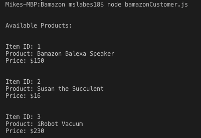
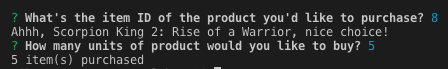
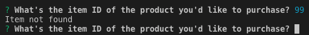
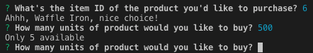
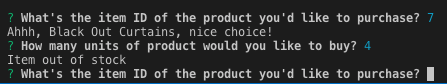

# Bamazon

Bamazon is a node.js app that utilizes mySQL to create an Amazon-like storefront. The app takes in orders from customers and then depletes stock from the store's inventory stored in a mySQL database.

When the Bamazon runs, it presents the user with all of the items offered, accompanied by a product ID and price as shown below.

The user is then asked to input the item ID of the specific product they're looking to purchase, followed by the quantity of product they want. If the user inputs a valid ID and there's enough product in stock to satisfy their requested quantity, the successful transaction is shown below:

However, if the user inputs a non-existent item ID, requests a quantity higher than the current amount in stock, or if the item requested is out of stock, Bamazon will display the error and give the user the opportunity to change their requests.

