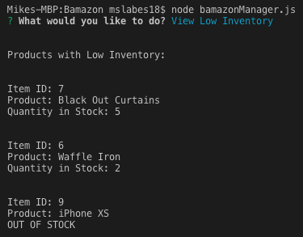

# Bamazon Node App

Bamazon is a node.js application that utilizes mySQL and the node package "Inquirer" to create an Amazon-like storefront. There are two different modes, customer and manager. As a customer, the app takes in orders and then depletes stock from the store's inventory stored in a mySQL database. As a manager, the app allows you to add new product to the store as well as replenish inventory. 

## Customer Mode

When a connection to the database is established, it presents the user with all of the items offered, accompanied by a product ID and price as shown below.

The user is then asked to input the item ID of the specific product they're looking to purchase, followed by the quantity of product they want. If the user inputs a valid ID and there's enough product in stock to satisfy their requested quantity, the successful transaction is shown below:

However, if the user inputs a non-existent item ID, requests a quantity higher than the current amount in stock, or if the item requested is out of stock, Bamazon will display the error and give the user the opportunity to change their requests.

## Manager Mode

When a connection to the database is established, it presents the user with the five options shown below:

Selecting "View Products for Sale" will present the same product information presented to the customer but also includes the department name and stock quantity. 

Selecting "View Low Inventory" will display all products that have 5 or less items in stock from highest to lowest stock quantity. If the stock quantity is zero then it will clearly be labeled OUT OF STOCK. 

Selecting "Add to Inventory" allows the user to choose one of the items currently listed in the store and add however many new units to the inventory, which will update in the mySQL database. 

Lastly, selecting "Add New Product" (take a wild guess) allows the user to add a product to the store, which will update in the mySQL database.

